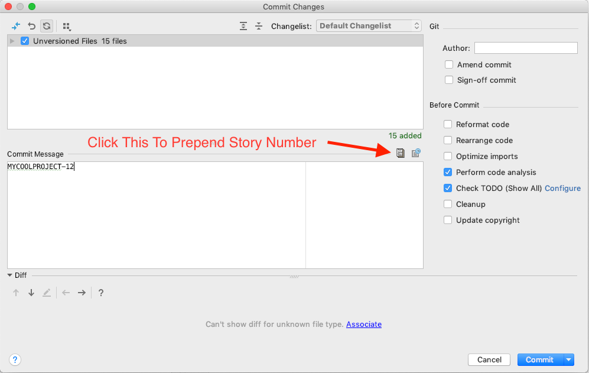

# JIRA Story Prepend Plugin

When developers are working with JIRA, it is common practice to name branches with the story number
from JIRA. So for example, if you have a story in JIRA _MyCoolProduct-23_ then more thank likely you 
will have a branch named _feature/MyCoolProduct-23_

This simple plugin will grab the story number from the branch name and prepend to the commit message and uppercase it. 

## Installation
Install this plugin via the plugin manager in IntelliJ (File &rarr; Settings &rarr; Plugins &rarr; Browse repositories &rarr; Prepend Story Number).

## Usage

Just push the button and it will populate your commit message !

## License

Copyright 2018 Ricardo Riveros <ricardo@sairic-consulting.com>  

This project and its contents are open source under the [MIT license](LICENSE.txt).